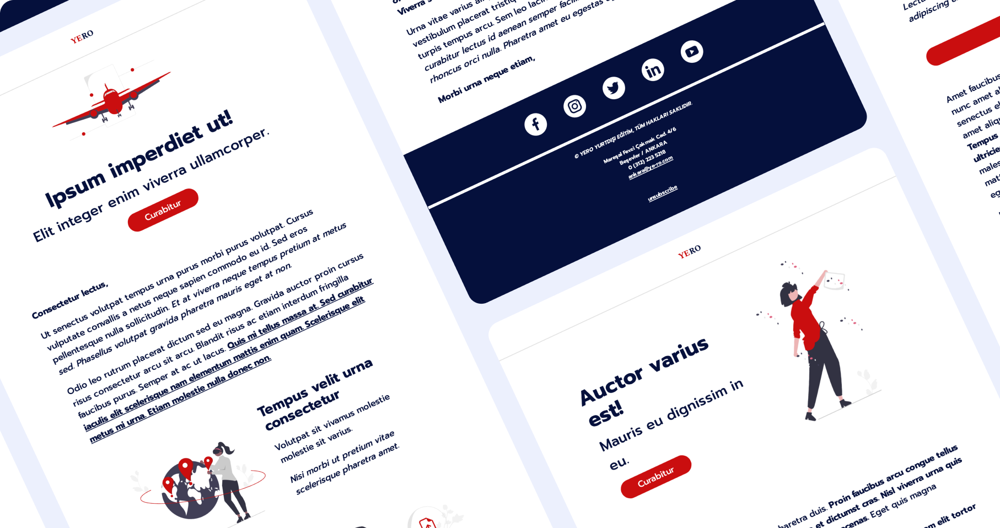

# YERO E-mails

### *Description*

This repository contains modular HTML sections necessary to be able to construct e-mails designed specifically
for **_[YERO International Education](https://www.ye-ro.com)_**. These modular sections are designed to be used as
consecutive
blocks placed in an e-mail top-to bottom.

### *Contents*

* `previews/`: `PNG` files of sample `HTML` e-mails constructed using the designed sections.
* `templates/`: `HTML` code and assets for sample e-mails and sections
    * `assets/`: Example `PNG` files used for illustration in the sample e-mails _(taken
      from [unDraw](https://undraw.co/illustrations))_.
    * `samples/`: `HTML` files of sample e-mails constructed using the designed sections
    * `social/`: `PNG` files used as social media icons in the `Footer` section
    * `template.html`: `HTML` file containing all the designed modular sections
* `html_img_embed.py`: Python script used to embed image data in the `index.html` file used to create the samples, and
  save
  the embedded version with the provided filename in `templates/samples/`

*Note: `index.html` is git ignored since it is a generator file with no need for git tracking.*

### *Modular Sections*

1. `Header`: Top-most section to be used in all e-mails. Contains a type-logo of the **_YERO_** brand.
2. `Banner`: Main visual section containing the title, subtitle, and hero.
    1. `[Text]`: `Banner` section with no hero visual, just titles.
    2. `[Right]`: `Banner` section with hero visual aligned right, titles aligned left.
    3. `[Center]`: `Banner` section with hero visual aligned top, titles aligned bottom.
    4. `[Left]`: `Banner` section with hero visual aligned left, titles aligned right.
3. `Body`: Text content section.
    1. `[Full Text]`: `Body` section with paragraphs only.
    2. `[Right]`: `Body` section with a visual aligned right, paragraphs aligned left.
    3. `[Left]`: `Body` section with a visual aligned left, paragraphs aligned right.
4. `Button`: A section containing a link styled as a mail-width button.
5. `Image`: A section containing a mail-width image.
6. `Footer`: Bottom-most section to be used in all e-mails. Contains social media links, copyright, contact information,
   unsubscription link.

### *Styles*

#### Fonts

* **Spectral**
  * _wght: 400 & **700**_
* **Prompt**
  * _wght: 500 & **700**_

#### Colors

* **Background**: _#FFFFFF_
* **Primary**: _#000D3B_
* **Secondary**: _#EC0B0C_

#### Headings

* **h1**: Used for `Banner` title
* **h2**: Used for `Banner` subtitle
* **h3**: Used for `Body` titles
* **h4**: Used for `Header` type-logo
* **h5**: Used for `Footer` text